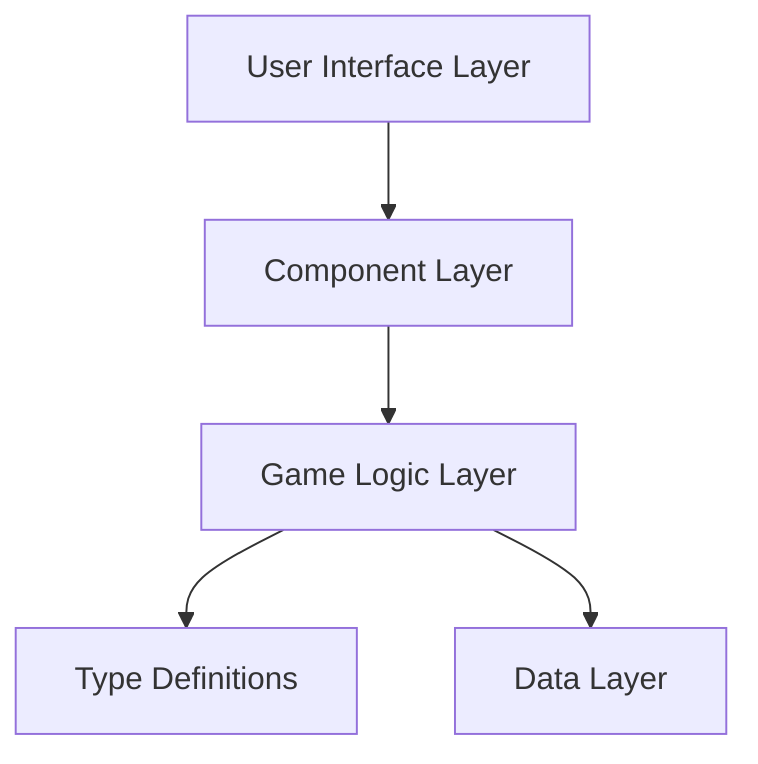

# Grimheim Combat Simulator System Patterns

## Architecture Overview


## Component Architecture
1. Screen Components
   - RangedTestScreen
   - CombatTestScreen
   - Main layout components

2. Combat Components
   - RangedCombatScreen
   - CombatScreen
   - Model selection
   - Weapon selection
   - Dice display

3. UI Components
   - ModelCard
   - WeaponInfo
   - DiceDisplay
   - CombatLog
   - Tooltips

## Design Patterns
1. State Management
   ```mermaid
   flowchart TD
       A[Component State] --> B[Combat Phase]
       B --> C[Dice State]
       C --> D[Model State]
       D --> E[Combat Log]
   ```

2. Component Communication
   - Props for parent-child communication
   - Callbacks for child-parent updates
   - Event handling for user interactions

3. Type Safety
   - Strong typing for game entities
   - Interface definitions for components
   - Type guards for runtime checks

## Data Flow
1. Combat Resolution
   ```mermaid
   flowchart TD
       A[User Input] --> B[Action Handler]
       B --> C[Rule Processing]
       C --> D[State Update]
       D --> E[UI Update]
   ```

2. State Updates
   ```mermaid
   flowchart TD
       A[Action Trigger] --> B[Validate Action]
       B --> C[Apply Rules]
       C --> D[Update State]
       D --> E[Render Changes]
   ```

## Key Patterns
1. Component Structure
   - Functional components with TypeScript
   - Styled-components for styling
   - Props interface definitions
   - State management hooks

2. Game Logic
   - Rule implementation functions
   - Combat resolution handlers
   - State management utilities
   - Type validation checks

3. UI Patterns
   - Consistent styling system
   - Reusable components
   - Responsive layouts
   - Interactive elements

## Code Organization
```
src/
├── components/
│   ├── combat/
│   │   ├── RangedCombatScreen.tsx
│   │   ├── CombatScreen.tsx
│   │   └── ...
│   └── ui/
│       ├── ModelCard.tsx
│       ├── WeaponInfo.tsx
│       └── ...
├── screens/
│   ├── RangedTestScreen.tsx
│   └── CombatTestScreen.tsx
├── types/
│   └── gameTypes.ts
└── data/
    ├── testModels.ts
    └── ruleDescriptions.ts
```

## Implementation Guidelines
1. Component Development
   - Use functional components
   - Implement strong typing
   - Maintain single responsibility
   - Document props and state

2. State Management
   - Use React hooks
   - Implement type-safe state
   - Handle state updates atomically
   - Maintain immutability

3. Rule Implementation
   - Separate logic from UI
   - Use type guards
   - Implement clear validation
   - Document edge cases 